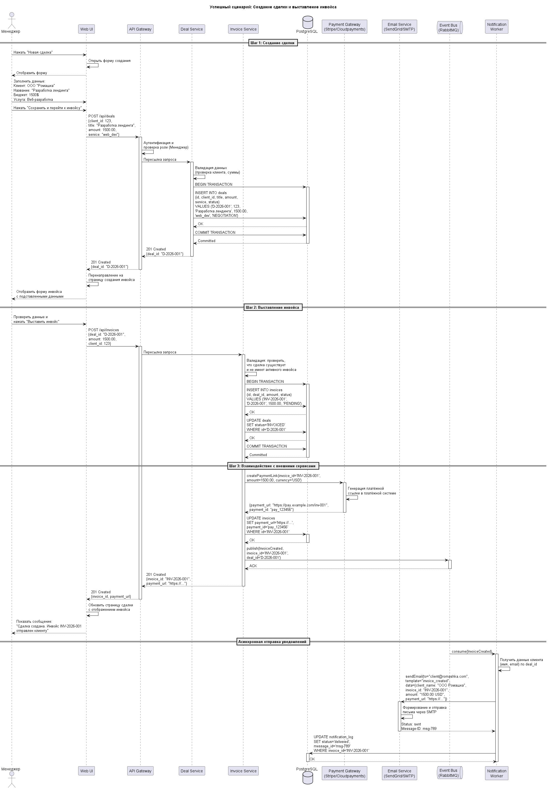

<p align="center">Министерство образования Республики Беларусь</p>
<p align="center">Учреждение образования</p>
<p align="center">"Брестский Государственный технический университет"</p>
<p align="center">Кафедра ИИТ</p>
<br><br><br><br><br><br>
<p align="center"><strong>Лабораторная работа №1</strong></p>
<p align="center"><strong>По дисциплине:</strong> "Проектирование интернет-систем"</p>
<p align="center"><strong>Тема:</strong> "Сценарий транзакции: моделирование use-case и границ ответственности"</p>
<br><br><br><br><br><br>
<p align="right"><strong>Выполнил:</strong></p>
<p align="right">Студент 3 курса</p>
<p align="right">Группы ПО-13</p>
<p align="right">Марковский Д.А.</p>
<p align="right"><strong>Проверил:</strong></p>
<p align="right">Несюк А.Н.</p>
<br><br><br><br><br>
<p align="center"><strong>Брест 2026</strong></p>

---

## Цель работы

Научиться анализировать бизнес-процессы интернет-системы, выявлять границы ответственности компонентов и моделировать транзакционные сценарии с учётом возможных сбоев.

---

## Вариант №6 - Мини-CRM «Фриланс без паники»

**Питч:** _Клиенты довольны, дедлайны живы._

**Ядро домена:** _Клиенты, Сделки, Этапы воронки, Задачи, Инвойсы_

---

## Ход выполнения работы

### 1. Структура проекта

```
lab-01/
├── README.md               # Основной отчёт (этот документ)
├── use-case.md             # Текстовое описание use-case
├── diagrams/
│   ├── sequence-happy.puml # PlantUML для успешного сценария
│   ├── sequence-happy.png  # Экспорт диаграммы
│   ├── sequence-error-payment.puml
│   └── sequence-error-payment.png
├── scenarios.feature       # Gherkin-сценарии
└── analysis.md             # Анализ границ ответственности
```

---

### 2. Use-case описание

👉 **Ссылка на файл:** [use-case.md](use-case.md)

**Основной сценарий:** _Создание сделки и выставление инвойса_

**Первичный актор:** _Менеджер (Project Manager)_

**Цель:** _Зафиксировать договорённость с клиентом (сделку) и выставить ему инвойс для получения предоплаты, запустив тем самым работу над проектом._

**Краткое описание основного потока:**
1. Менеджер провёл переговоры с клиентом и согласовал условия сделки.
2. Менеджер открывает CRM и переходит в раздел "Сделки".
3. Система отображает список текущих сделок и кнопку "Новая сделка".
4. Менеджер нажимает кнопку "Новая сделка".
5. Система открывает форму "Создание сделки" с полями: *Клиент, Название сделки, Бюджет, Услуга, Описание*.
6. Менеджер заполняет форму и нажимает "Сохранить и перейти к инвойсу".
7. Система проверяет заполнение обязательных полей, создаёт сделку со статусом "NEGOTIATION" и перенаправляет на страницу создания инвойса.
8. Менеджер проверяет детали и нажимает "Выставить инвойс".
9. Система создаёт инвойс со статусом "PENDING", связывает его со сделкой.
10. Система генерирует платёжную ссылку через платёжный шлюз и сохраняет её.
11. Система обновляет статус сделки на "INVOICED".
12. Система отправляет email клиенту с платёжной ссылкой.
13. Менеджер видит сообщение об успешном создании.

**Альтернативные потоки:**
- Создание нового клиента "на лету" при создании сделки
- Сохранение сделки как черновик без выставления инвойса
- Превышение бюджета сделки (требуется согласование)

**Исключительные ситуации:**
- Платёжный шлюз недоступен (таймаут)
- Сервис email-уведомлений недоступен
- База данных недоступна
- Конкурентное выставление инвойса по одной сделке

---

### 3. Диаграммы последовательности (Sequence Diagrams)

#### 3.1. Happy Path (успешный сценарий)

👉 **PlantUML исходник:** [sequence-happy.puml](diagrams/sequence-happy.puml)



**Описание потока:**
1. Менеджер заполняет форму и создаёт сделку (транзакция №1: запись в БД)
2. Система перенаправляет на создание инвойса
3. Менеджер подтверждает выставление инвойса
4. Система создаёт инвойс, обновляет статус сделки (транзакция №2)
5. Система генерирует платёжную ссылку через платёжный шлюз
6. Платёжный шлюз возвращает успешный ответ
7. Система сохраняет ссылку и публикует событие
8. Асинхронно отправляется email клиенту

**Участники:**
- Менеджер (актор)
- Web UI (фронтенд)
- API Gateway (шлюз)
- Deal Service (сервис сделок)
- Invoice Service (сервис инвойсов)
- PostgreSQL (база данных)
- Payment Gateway (внешний платёжный сервис)
- Email Service (внешний сервис уведомлений)
- Event Bus (RabbitMQ)

#### 3.2. Error Case (сценарий с ошибкой)

👉 **PlantUML исходник:** [sequence-error-payment.puml](diagrams/sequence-error-payment.puml)


**Описание потока:**
- Система успешно создаёт сделку и инвойс
- При попытке сгенерировать платёжную ссылку платёжный шлюз не отвечает (таймаут)
- Система не откатывает создание сделки и инвойса
- Инвойс переводится в статус "PENDING_RETRY"
- Событие о неудачной генерации публикуется в очередь
- Фоновый worker через 30 секунд повторяет запрос к платёжному шлюзу
- При успешной повторной попытке ссылка сохраняется, и клиенту отправляется email

---

### 4. Gherkin-сценарии

👉 **Ссылка на файл:** [scenarios.feature](scenarios.feature)

**Реализовано сценариев:** 5

**Список сценариев:**
1. ✅ **Успешный сценарий:** Создание сделки и выставление инвойса
2. ✅ **Ошибка:** Бюджет сделки превышает лимит (требуется согласование)
3. ✅ **Ошибка:** Платёжный шлюз недоступен (таймаут с retry)
4. ✅ **Ошибка:** Конкурентное выставление инвойса двумя менеджерами
5. ✅ **Ошибка:** Повторное выставление инвойса по уже оплаченной сделке

**Пример сценария:**
```gherkin
Feature: Создание сделки и выставление инвойса
  Как Менеджер фриланс-платформы
  Я хочу создавать сделки с клиентами и выставлять инвойсы
  Чтобы фиксировать договорённости и получать предоплату за работу

  Scenario: Успешное создание сделки и выставление инвойса
    Given менеджер провёл переговоры с клиентом "ООО Ромашка"
    And согласованы условия: бюджет 1500.00 USD, услуга "Веб-разработка"
    When менеджер создаёт новую сделку с этими данными
    And нажимает "Сохранить и перейти к инвойсу"
    And нажимает "Выставить инвойс"
    Then система создаёт сделку со статусом "NEGOTIATION"
    And система создаёт инвойс со статусом "PENDING"
    And система генерирует платёжную ссылку
    And система обновляет статус сделки на "INVOICED"
    And система отправляет email клиенту
    And менеджер видит сообщение об успешном создании
```

---

### 5. Анализ границ ответственности

👉 **Ссылка на файл:** [analysis.md](analysis.md)

#### 5.1. Транзакционные границы

| Операция | Синхронная/Асинхронная | Откат при ошибке | Retry-стратегия | Идемпотентность |
|----------|------------------------|------------------|-----------------|-----------------|
| **Валидация входных данных (клиент, сумма)** | Синхронная | Нет (просто возврат ошибки) | N/A | Да (чтение без side-effects) |
| **Создание записи Deal в БД** | Синхронная | Да (ROLLBACK транзакции №1) | Нет (контролируется БД) | Да (проверка дублей по `idempotency_key`) |
| **Проверка бюджета на превышение лимита** | Синхронная | Да (ROLLBACK транзакции №1) | Нет | Да |
| **Генерация уникального deal_id** | Синхронная | Нет (детерминированная генерация) | N/A | Да (UUID v4 или формат D-YYYY-NNNN) |
| **Проверка существования сделки и её статуса** | Синхронная | Да (откат транзакции №2 при невалидном статусе) | Нет | Да |
| **Создание записи Invoice в БД** | Синхронная | Да (ROLLBACK транзакции №2) | Нет | Да (проверка дублей по deal_id) |
| **Обновление статуса Deal на INVOICED** | Синхронная | Да (в той же транзакции №2) | Нет | Да |
| **Генерация платёжной ссылки через Payment Gateway** | Синхронная | Да (ROLLBACK транзакции №2) | 3 попытки с экспоненциальной задержкой (1s, 2s, 4s) | Да (по invoice_id) |
| **Сохранение платёжной ссылки в инвойсе** | Синхронная | Да (в той же транзакции №2) | Нет | Да |
| **Публикация доменных событий (DealCreated, InvoiceCreated)** | Синхронная (в transactional outbox) | Да (в той же транзакции) | Нет (часть основной транзакции) | Да (проверка дублей по event_id) |
| **Отправка email с инвойсом клиенту** | Асинхронная (через очередь) | Нет (инвойс уже создан) | 5 попыток с exponential backoff (1min, 5min, 15min, 1h, 6h) | Да (дедупликация по invoice_id + email) |
| **Запись событий в журнал событий (Events Log)** | Асинхронная (event sourcing) | Нет (best-effort) | 3 попытки | Да (дедупликация по event_id) |
| **Обновление кэша статистики менеджера (Redis)** | Асинхронная | Нет (eventual consistency) | 3 попытки с задержкой 1s | Да |

#### 5.2. Обработка исключительных ситуаций

**Реализовано стратегий обработки:** 5

**Примеры:**

#### Исключительная ситуация 1: Таймаут платёжного шлюза (Payment Gateway недоступен)

- **Условие возникновения:** Платёжный шлюз не отвечает в течение 5 секунд (таймаут) или возвращает HTTP 503 Service Unavailable
- **Обнаружение:** HTTP-клиент выбрасывает TimeoutException или получает статус-код 5xx. Система логирует событие: "Payment gateway timeout for invoice_id=INV-2026-001"
- **Реакция:**
  1. Система НЕ откатывает создание сделки и инвойса (инвойс уже в БД со статусом "PENDING")
  2. Инвойс переводится в статус "PENDING_RETRY" с сохранением ошибки в поле error_log
  3. Система публикует событие "PaymentLinkGenerationFailed" в очередь retry_queue
  4. Фоновый worker запускает повторную генерацию по расписанию
- **Компенсация:**
  - Worker пытается сгенерировать ссылку повторно: 30s, 1m, 2m, 5m, 15m (exponential backoff)
  - После 5 неудачных попыток инвойс помечается как "FAILED"
  - Отправляется уведомление администратору для ручного вмешательства
  - Менеджер может скопировать платёжную ссылку вручную (если позже сгенерируется)
- **Уведомление пользователя:** "Сделка создана, инвойс выставлен. Платёжная ссылка будет сгенерирована автоматически позже. Вы можете скопировать её из карточки инвойса, когда она появится."

#### Исключительная ситуация 2: Конкурентное выставление инвойса по одной сделке

- **Условие возникновения:** Два менеджера одновременно нажимают "Выставить инвойс" для одной и той же сделки (race condition)
- **Обнаружение:** Использование `SELECT ... FOR UPDATE` при проверке статуса сделки. Первый менеджер блокирует строку, второй ожидает снятия блокировки и обнаруживает, что статус уже "INVOICED"
- **Реакция:**
  1. Первый запрос успешно создаёт инвойс и обновляет статус сделки
  2. Второй запрос получает ошибку с кодом "INVOICE_ALREADY_EXISTS"
  3. Система возвращает уже существующий инвойс во втором ответе
- **Компенсация:** Второй менеджер не создаёт дубликат, а получает существующий инвойс. Сделка остаётся в консистентном состоянии (только один инвойс)
- **Уведомление пользователя:** "Инвойс по данной сделке уже был выставлен менеджером [Имя]. Обновите страницу для просмотра."

#### Исключительная ситуация 3: Превышение лимита бюджета сделки

- **Условие возникновения:** Сумма сделки превышает установленный лимит (10000 USD) без предварительного согласования
- **Обнаружение:** При создании сделки система проверяет бюджет. Если сумма > 10000 USD, срабатывает бизнес-правило
- **Реакция:**
  1. Система НЕ создаёт сделку в статусе "NEGOTIATION"
  2. Сделка создаётся в статусе "APPROVAL" (ожидание согласования)
  3. Система отправляет уведомление руководителю на согласование
  4. Менеджер видит форму для выбора руководителя и комментария
- **Компенсация:**
  - Если руководитель отклоняет → сделка переводится в статус "CANCELLED"
  - Если руководитель одобряет → сделка переводится в статус "NEGOTIATION", менеджер может выставить инвойс
  - Если сделка не согласована в течение 7 дней → автоматическая отмена
- **Уведомление пользователя:** "Сумма сделки превышает лимит. Требуется подтверждение руководителя. Выберите руководителя и оставьте комментарий."

#### Исключительная ситуация 4: Email-сервис недоступен

- **Условие возникновения:** Сервис отправки email не отвечает (таймаут 10 секунд) или возвращает ошибку 5xx
- **Обнаружение:** Notification Service возвращает исключение при попытке отправить email
- **Реакция:**
  1. Система НЕ откатывает создание сделки и инвойса (данные уже в БД)
  2. Email помещается в очередь notification_queue со статусом "pending"
  3. Система логирует предупреждение: "Email service unavailable for invoice INV-2026-001, notification queued for retry"
- **Компенсация:**
  - Фоновый worker пытается отправить email повторно: через 1 минуту, 5 минут, 15 минут, 1 час, 6 часов
  - После 5 неудачных попыток статус меняется на "failed"
  - Отправляется уведомление менеджеру в интерфейсе: "Не удалось отправить email клиенту. Скопируйте платёжную ссылку вручную."
- **Уведомление пользователя:** "Инвойс создан! Не удалось отправить email клиенту. Вы можете скопировать платёжную ссылку и отправить её вручную через мессенджер или телефон."

#### Исключительная ситуация 5: База данных недоступна

- **Условие возникновения:** PostgreSQL не отвечает (connection refused, timeout, network issue)
- **Обнаружение:** Пул соединений выбрасывает SQLException при попытке установить соединение или выполнить запрос
- **Реакция:**
  1. Система пытается выполнить транзакцию с 3 повторами (1s, 2s, 4s)
  2. Если все попытки не удались → транзакция откатывается
  3. Система возвращает HTTP 503 Service Unavailable
  4. Логируется ошибка с уровнем ERROR
- **Компенсация:**
  - При включённом offline-режиме данные сохраняются локально (IndexedDB/LocalStorage)
  - При восстановлении связи фоновый процесс синхронизирует данные с сервером
  - Конфликты разрешаются по принципу "последняя запись побеждает" с ручным подтверждением
- **Уведомление пользователя:** "Не удалось создать сделку. Попробуйте ещё раз или свяжитесь с техподдержкой. Если у вас проблемы с интернетом, сделка сохранится локально и синхронизируется автоматически."

---

## Таблица критериев оценки

| Критерий | Баллы | Выполнено |
|----------|-------|-----------|
| Use-case описание (полнота: акторы, предусловия, основной поток, альтернативы, исключения) | 15 | ✅ |
| Sequence diagram (happy path) - корректность нотации UML, включение всех ключевых компонентов | 20 | ✅ |
| Sequence diagram (error case) - моделирование хотя бы одной исключительной ситуации | 15 | ✅ |
| Gherkin-сценарии - минимум 4 сценария (1 успешный + 3 ошибочных) | 20 | ✅ |
| Анализ границ ответственности - таблица транзакционных границ, обоснование выбора синхронных/асинхронных операций | 15 | ✅ |
| Обработка исключений - описание стратегий retry, компенсации, уведомлений | 10 | ✅ |
| Качество документации - оформление, читаемость, грамотность | 5 | ✅ |
| **ИТОГО** | **100** | |

---

## Контрольные вопросы

**Подготовка к защите:**

1. Что такое транзакционная граница? Где она проходит в вашем сценарии?
   
   Транзакционная граница определяет набор операций, которые должны выполняться атомарно (всё или ничего). В моём сценарии выделены две транзакционные границы:
   
   - **Транзакция №1 (создание сделки):** Начинается при нажатии кнопки "Сохранить и перейти к инвойсу", заканчивается записью сделки в БД со статусом "NEGOTIATION". Включает валидацию данных, проверку лимита бюджета, создание записи Deal.
   
   - **Транзакция №2 (выставление инвойса):** Начинается при нажатии кнопки "Выставить инвойс", заканчивается сохранением платёжной ссылки. Включает проверку статуса сделки, создание инвойса, обновление сделки, генерацию платёжной ссылки.

2. Почему операция X выбрана синхронной, а Y - асинхронной?
   
   **Синхронные операции (создание сделки, инвойса, генерация платёжной ссылки):**
   - Критичны для бизнес-процесса
   - Без них сделка не может считаться завершённой
   - Требуют немедленного подтверждения пользователю
   - Влияют на целостность данных
   
   **Асинхронные операции (отправка email, запись в event log, обновление статистики):**
   - Не влияют на основной бизнес-процесс
   - Могут быть отложены без ущерба для пользователя
   - Клиент может получить инвойс с задержкой
   - Менеджер может отправить ссылку вручную как fallback

3. Как обеспечить идемпотентность при повторных запросах?
   
   Идемпотентность обеспечивается через:
   
   - **idempotency_key:** Клиент генерирует уникальный ключ (например, "manager-789_2026-03-12_14-30-15") и передаёт в заголовке запроса. При первом запросе ключ сохраняется в таблице `idempotent_requests` вместе с результатом. При повторном запросе с тем же ключом возвращается кэшированный ответ.
   
   - **Проверка существующих данных:** Перед созданием инвойса проверяем, нет ли уже инвойса для этой сделки. Если есть - возвращаем существующий.
   
   - **Уникальные индексы в БД:** Добавляем UNIQUE INDEX на поле `idempotency_key` и на комбинацию `(deal_id, status)` для активных инвойсов.
   
   - **Дедупликация в очередях:** Используем уникальные ключи для сообщений в RabbitMQ/Kafka, чтобы избежать двойной обработки.

4. Что произойдёт, если внешний сервис вернёт ошибку после частичного выполнения операции?
   
   В зависимости от типа ошибки:
   
   - **Платёжный шлюз недоступен:** Инвойс уже создан в БД, но без платёжной ссылки. Система помечает инвойс как "PENDING_RETRY" и ставит задачу в очередь. Фоновый worker повторяет запрос позже. Данные не теряются.
   
   - **Email-сервис недоступен:** Инвойс и ссылка успешно созданы. Email ставится в очередь для повторной отправки. Менеджер может отправить ссылку вручную.
   
   - **БД недоступна:** Вся транзакция откатывается (ROLLBACK). Если включён offline-режим, данные сохраняются локально для последующей синхронизации.

5. Как система обнаружит, что внешний сервис недоступен?
   
   - **Таймауты:** HTTP-клиент настроен с таймаутами (5 сек для платёжного шлюза, 10 сек для email). При превышении таймаута генерируется TimeoutException.
   
   - **Статус-коды HTTP:** При получении 5xx ошибок (503 Service Unavailable, 500 Internal Server Error) система интерпретирует это как недоступность сервиса.
   
   - **Health checks:** Система периодически проверяет доступность внешних сервисов через эндпоинты /health. При падении сервиса запросы направляются в очередь retry.
   
   - **Circuit Breaker:** Реализован паттерн Circuit Breaker. При определённом количестве ошибок (например, 5 ошибок за 1 минуту) цепь размыкается, и запросы сразу направляются в очередь без попытки вызова.

6. Какие данные нужно логировать для диагностики сбоев?
   
   - **Идентификаторы:** request_id, deal_id, invoice_id, user_id, session_id
   - **Временные метки:** timestamp начала и окончания операции, длительность выполнения
   - **Данные запроса:** endpoint, HTTP метод, заголовки (с маскированием sensitive data), тело запроса
   - **Информация об ошибке:** тип исключения, код ошибки, сообщение, stack trace (для DEBUG уровня)
   - **Контекст выполнения:** название сервиса, версия приложения, окружение (dev/staging/prod)
   - **Данные ответа:** статус-код, тело ответа (для неудачных запросов)
   - **Метрики производительности:** latency, количество попыток retry, размер очереди
   - **Трассировка:** correlation_id для связывания запросов между сервисами (distributed tracing)

---

## Ссылка на репозиторий

👉 **GitHub:** _[[ссылка]](https://github.com/carrotist-coder/PIS-2026)_

---

## Вывод

В ходе выполнения лабораторной работы был проанализирован бизнес-процесс создания сделки и выставления инвойса в мини-CRM «Фриланс без паники». Разработано подробное use-case описание с основным потоком, альтернативными сценариями (создание клиента "на лету", сохранение черновика, превышение лимита) и исключительными ситуациями (таймаут платёжного шлюза, конкурентное выставление инвойса, недоступность email-сервиса, сбой БД). Построены диаграммы последовательности (sequence diagrams) с использованием PlantUML для визуализации успешного сценария и сценария с ошибкой (таймаут платёжного шлюза с retry-механизмом). Созданы 5 Gherkin-сценариев (1 успешный и 4 ошибочных) для автоматизированного тестирования бизнес-логики. Проведён анализ границ ответственности с определением транзакционных границ, выбором синхронных и асинхронных операций, а также разработаны стратегии обработки исключительных ситуаций (retry с exponential backoff, компенсирующие действия, уведомления пользователя).

**Освоенные навыки:**
- Моделирование бизнес-процессов с использованием use-case и UML-диаграмм
- Построение sequence diagrams в PlantUML с нотацией активации/деактивации компонентов
- Написание Gherkin-сценариев в формате BDD для автоматизированного тестирования
- Анализ транзакционных границ в распределённых системах
- Проектирование отказоустойчивости: retry-стратегии (exponential backoff), компенсирующие транзакции (compensating actions), идемпотентность, circuit breaker

**Использованные инструменты:**
- PlantUML (диаграммы последовательности)
- Gherkin/Cucumber (сценарии тестирования)
- Markdown (оформление документации)
- VS Code с расширениями PlantUML, Cucumber (Gherkin) Full Support

**Сложности:** Наибольшую сложность вызвало проектирование retry-стратегии для платёжного шлюза с сохранением целостности данных. Решением стало разделение транзакций (сделка + инвойс) и использование очереди для отложенной обработки с exponential backoff (1s, 2s, 4s для платёжного шлюза и 1min, 5min, 15min, 1h, 6h для email). Также потребовалось продумать механизм идемпотентности для предотвращения дублирования инвойсов при повторных запросах.

**Новые знания:** Углублённое понимание принципов проектирования транзакционных систем, важности идемпотентности в распределённых средах, практические навыки работы с PlantUML и Gherkin, а также понимание компромиссов между consistency, availability и partition tolerance (CAP theorem) при проектировании интернет-систем.

---

**Дата выполнения:** _13.03_

**Оценка:** _____________

**Подпись преподавателя:** _____________
