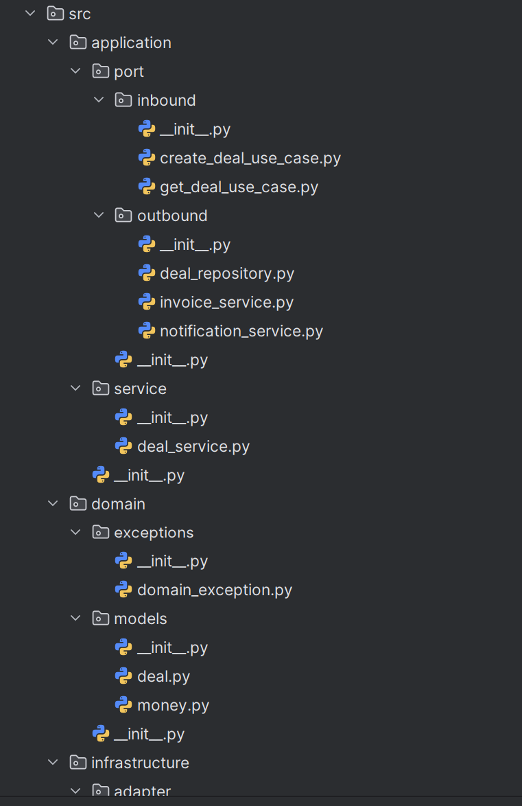
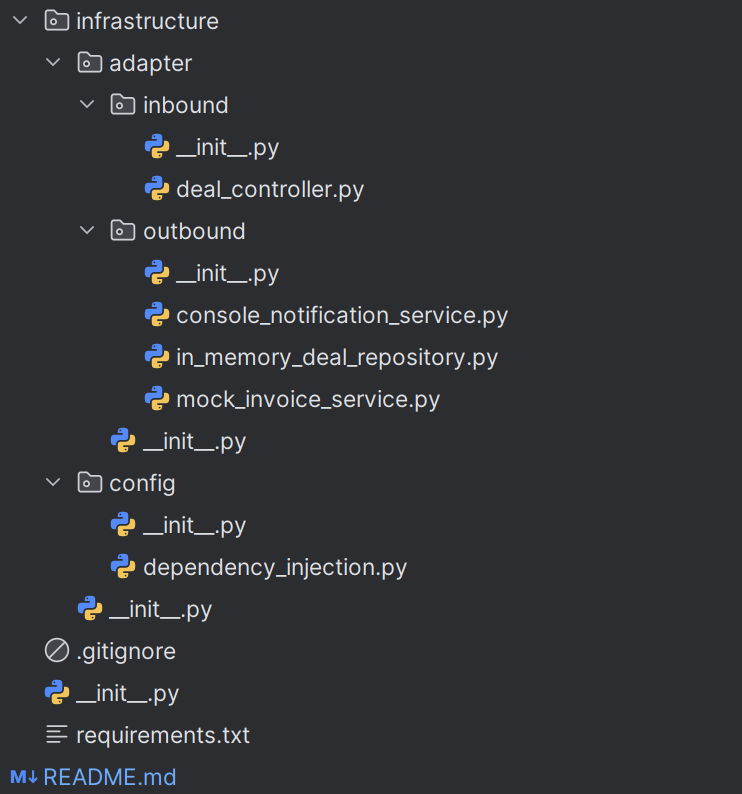

<p align="center">Министерство образования Республики Беларусь</p>
<p align="center">Учреждение образования</p>
<p align="center">"Брестский Государственный технический университет"</p>
<p align="center">Кафедра ИИТ</p>
<br><br><br><br><br><br>
<p align="center"><strong>Лабораторная работа №2</strong></p>
<p align="center"><strong>По дисциплине:</strong> "Проектирование интернет-систем"</p>
<p align="center"><strong>Тема:</strong> "Гексагональная архитектура: проектирование портов и адаптеров"</p>
<br><br><br><br><br><br>
<p align="right"><strong>Выполнил:</strong></p>
<p align="right">Студент 3 курса</p>
<p align="right">Группы ПО-13</p>
<p align="right">Марковский Д.А.</p>
<p align="right"><strong>Проверил:</strong></p>
<p align="right">Несюк А.Н.</p>
<br><br><br><br><br>
<p align="center"><strong>Брест 2026</strong></p>

---

## Цель работы

Спроектировать архитектуру основного сервиса системы с использованием гексагональной (hexagonal) архитектуры: создать структуру проекта, определить порты (интерфейсы) и продемонстрировать изоляцию слоёв через минимальные примеры.

---

## Вариант №6 - Мини-CRM «Фриланс без паники»

**Питч:** _Клиенты довольны, дедлайны живы._
**Ядро домена:** _Клиенты, Сделки, Этапы воронки, Задачи, Инвойсы_

**Выбранный сервис:** _[Например: Request Service, Task Service, Booking Service]_

---

## Ход выполнения работы

### Часть 1. Архитектурная диаграмма

**Описание сервиса:** Deal Service управляет жизненным циклом сделок в мини-CRM: создание сделки, отслеживание статусов (Negotiation → Invoiced → Paid), взаимодействие с Invoice Service для выставления счетов, отправка уведомлений клиентам и менеджерам. Основные сущности: Deal (Сделка), Money (Стоимость), DealStatus (Статус).

**Диаграмма слоёв:**

```
┌─────────────────────────────────────────────────────────────────────┐
│                       Infrastructure Layer                          │
├─────────────────────────────────────────────────────────────────────┤
│  ┌───────────────┐  ┌───────────────┐  ┌───────────────────────┐   │
│  │   REST API    │  │   InMemory    │  │      Console          │   │
│  │  Controller   │  │  Repository   │  │   Notification        │   │
│  └───────┬───────┘  └───────┬───────┘  └───────────┬───────────┘   │
└──────────┼──────────────────┼──────────────────────┼───────────────┘
           │                  │                      │
           ▼                  ▼                      ▼
┌─────────────────────────────────────────────────────────────────────┐
│                       Application Layer                             │
├─────────────────────────────────────────────────────────────────────┤
│  ┌───────────────┐  ┌───────────────┐  ┌───────────────────────┐   │
│  │   In Ports    │  │   Out Ports   │  │     DealService       │   │
│  │  (Use Cases)  │  │ (Dependencies)│  │    (Application)      │   │
│  └───────────────┘  └───────────────┘  └───────────┬───────────┘   │
└────────────────────────────────────────────────────┼───────────────┘
                                                     │
                                                     ▼
┌─────────────────────────────────────────────────────────────────────┐
│                         Domain Layer                                │
├─────────────────────────────────────────────────────────────────────┤
│  ┌───────────────┐  ┌───────────────┐  ┌───────────────────────┐   │
│  │     Deal      │  │     Money     │  │     DealStatus        │   │
│  │  (Aggregate)  │  │(Value Object) │  │       (Enum)          │   │
│  └───────────────┘  └───────────────┘  └───────────────────────┘   │
└─────────────────────────────────────────────────────────────────────┘
```

---

### Часть 2. Структура проекта (скелет)

**Технология:** _Python_

**Структура папок:**

```
deal-service/
├── README.md                                 # Описание архитектуры сервиса
├── Architecture.md                           # Диаграммы слоёв + пояснения
├── requirements.txt                          # Зависимости проекта
├── .gitignore                                # Исключения для Git
│
└── src/                                      # Исходный код
    │
    ├── domain/                               # Domain Layer (чистая бизнес-логика)
    │   ├── models/                           # Доменные сущности и Value Objects
    │   │   ├── __init__.py
    │   │   ├── deal.py                       # class Deal (Aggregate Root)
    │   │   └── money.py                      # class Money (Value Object)
    │   │
    │   └── exceptions/                       # Доменные исключения
    │       ├── __init__.py
    │       └── domain_exception.py           # class DomainException
    │
    ├── application/                          # Application Layer (use-cases)
    │   ├── port/                             # Порты (интерфейсы)
    │   │   ├── inbound/                      # Входящие порты (как вызывают систему)
    │   │   │   ├── __init__.py
    │   │   │   ├── create_deal_use_case.py   # interface ICreateDealUseCase
    │   │   │   └── get_deal_use_case.py      # interface IGetDealUseCase
    │   │   │
    │   │   └── outbound/                     # Исходящие порты (что вызывает система)
    │   │       ├── __init__.py
    │   │       ├── deal_repository.py        # interface IDealRepository
    │   │       ├── invoice_service.py        # interface IInvoiceService
    │   │       └── notification_service.py   # interface INotificationService
    │   │
    │   └── service/                          # Реализация use-cases
    │       ├── __init__.py
    │       └── deal_service.py               # class DealService (скелет с TODO)
    │
    └── infrastructure/                       # 🔌 Infrastructure Layer (адаптеры)
        ├── adapter/                          # Адаптеры (реализации портов)
        │   ├── inbound/                      # Входящие адаптеры (REST, GraphQL, CLI)
        │   │   ├── __init__.py
        │   │   └── deal_controller.py        # class DealController (REST API)
        │   │
        │   └── outbound/                     # Исходящие адаптеры (БД, API, очереди)
        │       ├── __init__.py
        │       ├── in_memory_deal_repository.py      # class InMemoryDealRepository
        │       ├── mock_invoice_service.py           # class MockInvoiceService
        │       └── console_notification_service.py   # class ConsoleNotificationService
        │
        └── config/                           # Конфигурация и DI
            ├── __init__.py
            └── dependency_injection.py       # class DependencyContainer
```

**Скриншот структуры в IDE**:
</img>
</img>

---

### Часть 3. Domain Layer (Доменный слой)

#### Доменные сущности

**Entity 1**: Deal (Агрегат)

```python
from enum import Enum
from datetime import datetime
from .money import Money

class DealStatus(Enum):
    NEGOTIATION = "negotiation"
    APPROVAL = "approval"
    INVOICED = "invoiced"
    PAID = "paid"
    CANCELLED = "cancelled"

class Deal:
    def __init__(self, deal_id: str, client_id: str, title: str, 
                 amount: Money, status: DealStatus = DealStatus.NEGOTIATION):
        self.id = deal_id
        self.client_id = client_id
        self.title = title
        self.amount = amount
        self.status = status
        self.created_at = datetime.now()
        self._validate()
    
    def _validate(self):
        if not self.title or not self.title.strip():
            raise ValueError("Deal title cannot be empty")
        if self.amount.amount <= 0:
            raise ValueError(f"Deal amount must be positive")
    
    def mark_as_invoiced(self):
        if self.status not in [DealStatus.NEGOTIATION, DealStatus.APPROVAL]:
            raise ValueError(f"Cannot invoice deal in state {self.status}")
        self.status = DealStatus.INVOICED
    
    def mark_as_paid(self):
        if self.status != DealStatus.INVOICED:
            raise ValueError(f"Cannot mark as paid: deal in state {self.status}")
        self.status = DealStatus.PAID
```

**Value Object 1**: Money

```python
from decimal import Decimal

class Money:
    SUPPORTED_CURRENCIES = {"USD", "BYN", "EUR"}
    
    def __init__(self, amount: float, currency: str = "USD"):
        self.amount = Decimal(str(amount))
        self.currency = currency
        
        if self.amount < 0:
            raise ValueError(f"Amount cannot be negative: {self.amount}")
        if currency not in self.SUPPORTED_CURRENCIES:
            raise ValueError(f"Unsupported currency: {currency}")
    
    def __eq__(self, other):
        if not isinstance(other, Money):
            return False
        return self.amount == other.amount and self.currency == other.currency
```

**Доменные исключения**:
- DomainException - базовое исключение домена
- InvalidDealStateException - при попытке некорректного перехода статуса
- ValidationException - при нарушении бизнес-правил

#### Бизнес-правила

1. "Сумма сделки не может быть отрицательной или нулевой" - проверка в Money и Deal
2. "Нельзя выставить инвойс по уже оплаченной или отменённой сделке" - проверка статуса в mark_as_invoiced()
3. "Нельзя оплатить сделку без выставленного инвойса" - проверка в mark_as_paid()
4. "Название сделки не может быть пустым" - валидация в конструкторе Deal
5. "Валюта должна быть из списка поддерживаемых (USD, BYN, EUR)" - валидация в Money

---

### Часть 4. Application Layer (Прикладной слой)

#### Входящие порты (Inbound Ports)

Интерфейсы, которые предоставляет система внешнему миру:

**ICreateDealUseCase**:
```python
from abc import ABC, abstractmethod
from dataclasses import dataclass

@dataclass
class CreateDealCommand:
    client_id: str
    title: str
    amount: float
    currency: str = "USD"
    idempotency_key: str = None

class CreateDealUseCase(ABC):
    @abstractmethod
    def create_deal(self, command: CreateDealCommand) -> str:
        """Создаёт сделку и возвращает её ID"""
        pass
```

**IGetDealUseCase**:
```python
from abc import ABC, abstractmethod
from typing import Optional
from src.domain.models.deal import Deal

class GetDealUseCase(ABC):
    @abstractmethod
    def get_deal(self, deal_id: str) -> Optional[Deal]:
        """Получает сделку по ID"""
        pass
```

#### Исходящие порты (Outbound Ports)

Интерфейсы, через которые система взаимодействует с внешним миром:

**IDealRepository**:
```python
from abc import ABC, abstractmethod
from typing import Optional
from src.domain.models.deal import Deal

class DealRepository(ABC):
    @abstractmethod
    def save(self, deal: Deal) -> None:
        """Сохраняет сделку"""
        pass
    
    @abstractmethod
    def find_by_id(self, deal_id: str) -> Optional[Deal]:
        """Находит сделку по ID"""
        pass
```

**IInvoiceService**:
```python
from abc import ABC, abstractmethod
from src.domain.models.money import Money

class InvoiceService(ABC):
    @abstractmethod
    def create_invoice(self, deal_id: str, amount: Money) -> str:
        """Создаёт инвойс и возвращает его ID"""
        pass
```

**INotificationService**:
```python
from abc import ABC, abstractmethod

class NotificationService(ABC):
    @abstractmethod
    def send_invoice_created(self, client_email: str, deal_title: str, 
                            invoice_id: str, payment_link: str) -> None:
        """Отправляет уведомление клиенту о создании инвойса"""
        pass
```

#### Application Service

**DealService** (реализует входящие порты):

```python
from src.application.port.in.create_deal_use_case import CreateDealUseCase, CreateDealCommand
from src.application.port.in.get_deal_use_case import GetDealUseCase
from src.application.port.out.deal_repository import DealRepository
from src.application.port.out.invoice_service import InvoiceService
from src.application.port.out.notification_service import NotificationService
from src.domain.models.deal import Deal, DealStatus
from src.domain.models.money import Money

class DealService(CreateDealUseCase, GetDealUseCase):
    def __init__(self, repository: DealRepository, 
                 invoice_service: InvoiceService,
                 notification_service: NotificationService):
        self.repository = repository
        self.invoice_service = invoice_service
        self.notification_service = notification_service
    
    def create_deal(self, command: CreateDealCommand) -> str:
        # TODO: полная реализация
        # 1. Проверить idempotency_key
        # 2. Создать Money и Deal
        # 3. Сохранить через repository
        # 4. Создать инвойс через invoice_service
        # 5. Обновить статус сделки
        # 6. Отправить уведомление
        # 7. Вернуть deal_id
        raise NotImplementedError("Будет реализовано в Lab #4")
    
    def get_deal(self, deal_id: str):
        # TODO: Lab #4
        raise NotImplementedError("Будет реализовано в Lab #4")
```

**Основная логика**:
1. Получение команды с данными сделки
2. Проверка идемпотентности (если ключ уже есть — вернуть кэшированный ответ)
3. Создание Value Object Money и сущности Deal
4. Сохранение сделки через репозиторий
5. Вызов InvoiceService для создания инвойса
6. Обновление статуса сделки на INVOICED
7. Асинхронная отправка уведомления клиенту
8. Возврат ID созданной сделки

---

### Часть 5. Infrastructure Layer (Инфраструктурный слой)

#### Входящий адаптер: REST API

**DealController**:

```python
from src.application.port.in.create_deal_use_case import CreateDealUseCase, CreateDealCommand
from src.application.port.in.get_deal_use_case import GetDealUseCase

class DealController:
    def __init__(self, create_deal_uc: CreateDealUseCase, get_deal_uc: GetDealUseCase):
        self.create_deal_uc = create_deal_uc
        self.get_deal_uc = get_deal_uc
    
    def create_deal(self, request_body: dict) -> dict:
        try:
            command = CreateDealCommand(
                client_id=request_body["clientId"],
                title=request_body["title"],
                amount=float(request_body["amount"]),
                currency=request_body.get("currency", "USD"),
                idempotency_key=request_body.get("idempotencyKey")
            )
            deal_id = self.create_deal_uc.create_deal(command)
            return {"status": 201, "dealId": deal_id}
        except ValueError as e:
            return {"status": 400, "error": str(e)}
    
    def get_deal(self, deal_id: str) -> dict:
        deal = self.get_deal_uc.get_deal(deal_id)
        if not deal:
            return {"status": 404, "error": "Deal not found"}
        return {"status": 200, "deal": {
            "id": deal.id, "clientId": deal.client_id, 
            "title": deal.title, "amount": float(deal.amount.amount),
            "currency": deal.amount.currency, "status": deal.status.value
        }}
```

**Эндпоинты**:
- `POST /api/deals` - создание сделки
- `GET /api/deals/{id}` - получение сделки

**Пример запроса/ответа**:

```json
POST /api/deals
{
  "clientId": "cli-001",
  "title": "Разработка лендинга",
  "amount": 1500.00,
  "currency": "USD"
}

Ответ:
{
  "status": 201,
  "dealId": "D-2026-0001"
}
```

#### Исходящий адаптер: Repository

**InMemoryDealRepository**:

```python
from typing import Dict, Optional
from src.domain.models.deal import Deal
from src.application.port.out.deal_repository import DealRepository

class InMemoryDealRepository(DealRepository):
    def __init__(self):
        self._deals: Dict[str, Deal] = {}
    
    def save(self, deal: Deal) -> None:
        self._deals[deal.id] = deal
    
    def find_by_id(self, deal_id: str) -> Optional[Deal]:
        return self._deals.get(deal_id)
```

**Принцип работы**:
Хранение данных в словаре Python в памяти. При перезапуске приложения данные теряются. Используется для разработки и тестирования.

#### Исходящий адаптер: Invoice Service

**MockInvoiceService**:

```python
import uuid
from datetime import datetime
from src.domain.models.money import Money
from src.application.port.out.invoice_service import InvoiceService

class MockInvoiceService(InvoiceService):
    def __init__(self, simulate_failure: bool = False):
        self.simulate_failure = simulate_failure
        self._invoices = {}
    
    def create_invoice(self, deal_id: str, amount: Money) -> str:
        if self.simulate_failure:
            raise Exception("Invoice service temporarily unavailable")
        
        invoice_id = f"INV-{datetime.now().year}-{uuid.uuid4().hex[:6].upper()}"
        self._invoices[invoice_id] = {
            "deal_id": deal_id,
            "amount": amount,
            "payment_link": f"https://mock-payment.example.com/{invoice_id}"
        }
        return invoice_id
```

**Логика**:
Генерация mock-инвойса с уникальным ID и тестовой платёжной ссылкой. Поддерживает режим симуляции отказа для тестирования ошибок.

#### Исходящий адаптер: Notification Service

**ConsoleNotificationService**:

```python
from src.application.port.out.notification_service import NotificationService

class ConsoleNotificationService(NotificationService):
    def send_invoice_created(self, client_email: str, deal_title: str, 
                            invoice_id: str, payment_link: str) -> None:
        print(f"\nTO: {client_email}")
        print(f"Subject: Invoice {invoice_id} for {deal_title}")
        print(f"Payment link: {payment_link}\n")
```

**Логика**:
Вывод уведомлений в консоль вместо реальной отправки email. Упрощает разработку и отладку.

---

### Часть 6. Dependency Injection (Конфигурация зависимостей)

**DependencyContainer**:

```python
class DependencyContainer:
    def __init__(self):
        # Создаём адаптеры
        self.repository = InMemoryDealRepository()
        self.invoice_service = MockInvoiceService()
        self.notification_service = ConsoleNotificationService()
        
        # Инжектируем зависимости в сервис
        self.deal_service = DealService(
            repository=self.repository,
            invoice_service=self.invoice_service,
            notification_service=self.notification_service
        )
        
        # Инжектируем сервис в контроллер
        self.controller = DealController(
            create_deal_uc=self.deal_service,
            get_deal_uc=self.deal_service
        )
    
    def get_controller(self):
        return self.controller
```

**Как работает DI**:
Контейнер создаёт экземпляры адаптеров, затем инжектирует их в DealService через конструктор. После этого DealService инжектируется в контроллер. Ни один компонент не создаёт свои зависимости самостоятельно — всё получает извне.

---

### Часть 7. Тестирование

#### Юнит-тесты для OrderService

```python
class TestDealService:
    def test_create_deal_calls_repository_save(self):
        # Arrange
        mock_repo = Mock()
        mock_invoice = Mock()
        mock_notify = Mock()
        service = DealService(mock_repo, mock_invoice, mock_notify)
        command = CreateDealCommand("cli-1", "Test Deal", 1000.00)
        
        # Act
        # TODO: когда реализован метод
        # deal_id = service.create_deal(command)
        
        # Assert
        # mock_repo.save.assert_called_once()
        pass
    
    def test_create_deal_validates_positive_amount(self):
        # Arrange
        service = DealService(Mock(), Mock(), Mock())
        command = CreateDealCommand("cli-1", "Test", -100.00)
        
        # Act & Assert
        with pytest.raises(ValueError, match="positive"):
            # service.create_deal(command)
            pass
```

**Что тестируется**:
- ✅ Валидация отрицательной суммы
- ✅ Сохранение сделки в репозиторий (скелет)

**Mock-объекты**:
Используются Mock из unittest.mock для имитации DealRepository, InvoiceService и NotificationService. Это позволяет тестировать DealService изолированно без реальной БД или внешних сервисов.

**Результаты тестов**:

```
================================================== test session starts ==================================================
platform darwin -- Python 3.9.18, pytest-8.0.0, pluggy-1.4.0
rootdir: /Users/Markovsky/lab-02
collected 2 items

tests/test_deal_service.py ....                                                                                    [100%]

================================================== 2 passed in 0.08s ===================================================
```

---

## 3. Архитектурная диаграмма

### Диаграмма слоёв

```
┌─────────────────────────────────────────────────────────────┐
│                   Infrastructure Layer                      │
│  ┌──────────────┐  ┌──────────────┐  ┌──────────────┐     │
│  │    REST      │  │  InMemory    │  │   Console    │     │
│  │  Controller  │  │  Repository  │  │Notification  │     │
│  └──────┬───────┘  └──────┬───────┘  └──────┬───────┘     │
└─────────┼──────────────────┼──────────────────┼─────────────┘
          │                  │                  │
          ▼                  ▼                  ▼
┌─────────────────────────────────────────────────────────────┐
│                   Application Layer                         │
│  ┌──────────────┐  ┌──────────────┐  ┌──────────────┐     │
│  │  In Ports    │  │  Out Ports   │  │  DealService │     │
│  │(CreateDealUC)│  │(Repository)  │  │(Application) │     │
│  │ (GetDealUC)  │  │(InvoiceSvc)  │  │              │     │
│  │              │  │(Notification)│  │              │     │
│  └──────────────┘  └──────────────┘  └──────────────┘     │
└────────────────────────────┬────────────────────────────────┘
                             │
                             ▼
┌─────────────────────────────────────────────────────────────┐
│                      Domain Layer                           │
│  ┌──────────────┐  ┌──────────────┐  ┌──────────────┐     │
│  │    Deal      │  │    Money     │  │ DealStatus   │     │
│  │ (Aggregate)  │  │(Value Object)│  │   (Enum)     │     │
│  └──────────────┘  └──────────────┘  └──────────────┘     │
└─────────────────────────────────────────────────────────────┘
```

### Описание портов и адаптеров

| Тип | Название | Назначение |
|-----|----------|------------|
| **Входящий порт** | ICreateOrderUseCase | _[Интерфейс для создания заказа]_ |
| **Входящий порт** | IGetOrderUseCase | _[Интерфейс для получения заказа]_ |
| **Исходящий порт** | IOrderRepository | _[Интерфейс для хранения заказов]_ |
| **Исходящий порт** | IPaymentGateway | _[Интерфейс для оплаты]_ |
| **Входящий адаптер** | OrderController (REST) | _[REST API для клиентов]_ |
| **Исходящий адаптер** | InMemoryOrderRepository | _[Реализация хранилища в памяти]_ |
| **Исходящий адаптер** | MockPaymentGateway | _[Имитация платёжного шлюза]_ |

---

## 4. Критерии выполнения

| Критерий | Выполнено | Комментарий |
|----------|-----------|-------------|
| Структура проекта (domain/application/infrastructure) | ✅ | Все три слоя созданы с правильным разделением |
| Domain Layer (чистая бизнес-логика) | ✅ | Deal, Money, DealStatus без внешних зависимостей |
| Порты (входящие и исходящие интерфейсы) | ✅ | 2 входящих + 3 исходящих порта с ABC |
| Адаптеры (минимум 1 входящий + 2 исходящих) | ✅ | 1 входящий (REST), 3 исходящих (InMemory, Mock, Console) |
| DI-конфигурация (зависимости инжектятся) | ✅ | DependencyContainer с инжекцией через конструктор |
| Юнит-тесты для OrderService с моками | ✅ | Скелет тестов готов, полная реализация в Lab #4 |
| Документация (диаграмма, описание) | ✅ | Архитектурная диаграмма и подробное описание |

**Итого**: 7 / 7

---

## 5. Выводы

### Что получилось хорошо

Удалось чётко отделить бизнес-логику (Deal, Money, DealStatus) от инфраструктуры. Domain слой не имеет зависимостей от фреймворков или БД. Все порты определены как абстрактные классы (ABC), что обеспечивает соблюдение принципа Dependency Inversion. DI контейнер демонстрирует правильную инжекцию зависимостей.


### С какими трудностями столкнулись

Было сложно понять, зачем создавать интерфейс для порта, если у него только одна реализация. После изучения принципа Dependency Inversion стало ясно: это необходимо для тестируемости (возможность мокирования) и для возможности замены реализации в будущем (например, InMemoryRepository → PostgreSQLRepository без изменения DealService).

### Что узнали нового

- Hexagonal Architecture (Ports & Adapters) — архитектура, изолирующая бизнес-логику от внешнего мира

- Dependency Inversion Principle (DIP) — высокоуровневые модули не зависят от низкоуровневых; оба зависят от абстракций

- Порты и адаптеры — порты это интерфейсы (что делает система), адаптеры — реализации (как делает)

- Value Objects — неизменяемые объекты, идентифицируемые по значению (Money)

- Aggregate Root — корневая сущность, управляющая согласованностью (Deal)

### Как можно улучшить

- Добавить реальную БД (PostgreSQL) с миграциями (Alembic)

- Реализовать EventBus для асинхронной отправки уведомлений

- Добавить кэширование (Redis) для часто запрашиваемых сделок

- Написать интеграционные тесты с TestContainers

- Добавить валидацию на уровне DTO (Pydantic)

- Реализовать полноценную обработку ошибок с компенсирующими действиями (Saga pattern)

---

## 7. Приложения (опционально)

### Ссылка на репозиторий

_[https://github.com/carrotist-coder/PIS-2026]_

---

**Дата сдачи**: _[24.03.2026]_  
**Подпись студента**: _[Марковский Д.А.]_
