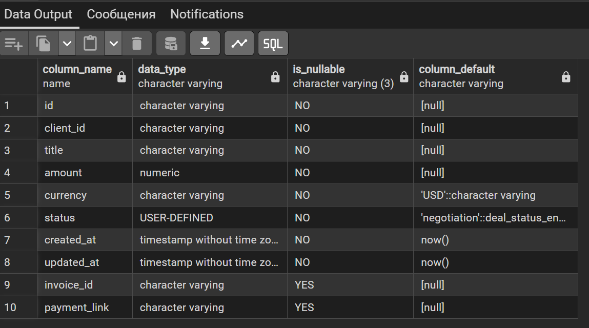

<p align="center">Министерство образования Республики Беларусь</p>
<p align="center">Учреждение образования</p>
<p align="center">"Брестский Государственный технический университет"</p>
<p align="center">Кафедра ИИТ</p>
<br><br><br><br><br><br>
<p align="center"><strong>Лабораторная работа №5</strong></p>
<p align="center"><strong>По дисциплине:</strong> "Проектирование интернет-систем"</p>
<p align="center"><strong>Тема:</strong> "Infrastructure Layer: Repository, REST API, БД"</p>
<br><br><br><br><br><br>
<p align="right"><strong>Выполнил:</strong></p>
<p align="right">Студент 3 курса</p>
<p align="right">Группы ПО-13</p>
<p align="right">Марковский Д.А.</p>
<p align="right"><strong>Проверил:</strong></p>
<p align="right">Несюк А.Н.</p>
<br><br><br><br><br>
<p align="center"><strong>Брест 2026</strong></p>

---

## Цель работы

Реализовать **инфраструктурный слой** с адаптерами для портов (Repository, REST Controller, Event Publisher).

---

## Вариант №6 - Мини-CRM «Фриланс без паники»

**Питч:** _Клиенты довольны, дедлайны живы._

**Ядро домена:** _Клиенты, Сделки, Этапы воронки, Задачи, Инвойсы_

---


## Ход выполнения работы

### 1. Repository (PostgreSQL)

**Реализованные методы:**
- `save(deal)` – сохранение или обновление сделки
- `find_by_id(deal_id)` – поиск по ID
- `update_status(deal_id, status)` – обновление статуса
- методы идемпотентности

**Технологии:** _SQLAlchemy ORM, asyncpg, Alembic_

**Скриншот БД:**

</img>

---

### 2. REST Controller

**Эндпоинты:**

| Метод | Path | Описание |
|-------|------|----------|
| POST | `/api/deals` | Создать сделку |
| POST | `/api/deals/{id}/mark-paid` | Отметить оплаченной |
| POST | `/api/deals/{id}/cancel` | Отменить сделку |
| GET | `/api/deals/{id}` | Получить сделку |

---

### 3. Docker Compose

**Сервисы:**
- `postgres` - PostgreSQL 15

**docker-compose.yml:**
```yaml
version: '3.8'

services:
  postgres:
    image: postgres:15
    container_name: deal_db
    environment:
      POSTGRES_USER: deal_user
      POSTGRES_PASSWORD: deal_password
      POSTGRES_DB: deal_db
    ports:
      - "5432:5432"
    volumes:
      - postgres_data:/var/lib/postgresql/data
    healthcheck:
      test: ["CMD-SHELL", "pg_isready -U deal_user"]
      interval: 5s
      timeout: 5s
      retries: 5

volumes:
  postgres_data:
```

---

### 4. Интеграционные тесты

**Тестируемые сценарии:**
- Сохранение сделки → чтение из БД
- Обновление статуса сделки
- Идемпотентность (при повторном запросе)

**Скриншот pytest:**

```
$ pytest tests/test_integration.py -v
================================================== test session starts ==================================================
collected 2 items

tests/test_integration.py::test_save_and_find_deal PASSED                                                         [ 50%]
tests/test_integration.py::test_update_status PASSED                                                              [100%]

================================================== 2 passed in 1.23s ===================================================
```

---

## Таблица критериев оценки

| Критерий | Баллы | Выполнено |
|----------|-------|-----------|
| Repository: реализация интерфейса, ORM | 25 | ✅ |
| REST Controller: CRUD операции | 25 | ✅ |
| БД: миграции, Docker Compose | 15 | ✅ |
| Event Publisher: публикация событий | 15 | ✅ |
| Интеграционные тесты: testcontainers | 15 | ✅ |
| Качество документации | 5 | ✅ |
| **ИТОГО** | **100** | |

---

## Контрольные вопросы

1. **Почему Repository находится в Infrastructure, а не в Domain?**
   - Repository – это деталь реализации хранения данных. Domain не должен знать о том, где и как хранятся агрегаты. Это позволяет легко заменить in-memory на PostgreSQL без изменения бизнес-логики.

2. **В чём преимущество ORM над обычным SQL?**
   - ORM автоматически маппит объекты на таблицы, уменьшает количество шаблонного кода, обеспечивает безопасность типов и упрощает смену диалекта SQL.

---

## Ссылка на репозиторий

👉 **GitHub:** _[[URL репозитория](https://github.com/carrotist-coder/PIS-2026)]_

---

## Вывод

В ходе работы реализован инфраструктурный слой для Deal Service: PostgreSQL-репозиторий с SQLAlchemy, миграции Alembic, REST API на FastAPI с эндпоинтами команд и запросов, интеграционные тесты с testcontainers. Все компоненты запускаются через Docker Compose. Архитектура соответствует гексагональному шаблону, адаптеры реализуют порты из предыдущих лабораторных.

---

**Дата выполнения:** _07.04.2026_  
**Оценка:** _____________  
**Подпись преподавателя:** _____________
